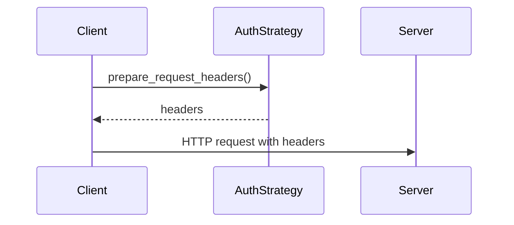

# apiconfig.auth

Authentication framework for **apiconfig**.  This package defines the common `AuthStrategy` base class and bundles the built in authentication strategies and token utilities.

## Module Description

The authentication package provides a unified interface for attaching credentials to outbound HTTP requests.  It implements several out-of-the-box strategies, including basic authentication, bearer tokens with optional refresh logic and simple API key handling.

The framework exists so that client code does not need to understand the nuances of different authentication schemes.  By abstracting the preparation of headers and query parameters behind the `AuthStrategy` interface, it becomes trivial to swap between strategies or add custom ones without rewriting consumers.

Within **apiconfig** this module underpins the `ClientConfig` class and every request that passes through the library.  The design follows the Strategy pattern, making it straightforward to extend or modify authentication behaviour while keeping configuration consistent across clients.

## Navigation
- [apiconfig](../README.md) – project overview and main documentation.
- [strategies](./strategies/README.md) – built-in authentication strategies.
- [token](./token/README.md) – utilities for managing OAuth2 tokens.

## Contents
- `base.py` – abstract `AuthStrategy` with refresh support.
- `strategies/` – collection of ready to use strategies such as `BasicAuth`, `BearerAuth` and `ApiKeyAuth`.
- `token/` – helpers for OAuth2 token refresh and storage.
- `__init__.py` – re-exports the most used classes for convenience.

## Usage Examples
```python
from datetime import datetime, timedelta, timezone
from apiconfig.auth import AuthStrategy
from apiconfig.auth.strategies import BearerAuth
from apiconfig.config import ClientConfig

# Set up bearer authentication with expiry
auth = BearerAuth(
    access_token="secret",
    expires_at=datetime.now(timezone.utc) + timedelta(hours=1),
)

config = ClientConfig(hostname="api.example.com", auth_strategy=auth)
headers = auth.prepare_request_headers()
```

## Status
**Stability:** Stable
**API Version:** 1.0
**Deprecations:** None


## Key classes
| Name | Description |
| ---- | ----------- |
| `AuthStrategy` | Base class defining `prepare_request_headers`, `prepare_request_params` and optional refresh logic. |
| `ApiKeyAuth` | Sends an API key either in a header or as a query parameter. |
| `BasicAuth` | Adds `Authorization: Basic ...` headers with a username and password. |
| `BearerAuth` | Uses a bearer token and can refresh it when expired. |
| `CustomAuth` | Allows user provided callbacks for headers, parameters and refresh. |

### Design pattern
All strategies implement **Strategy** pattern via the `AuthStrategy` interface and can be swapped without affecting client code.

## Diagram


## Tests
Install dependencies and run the unit tests for the authentication package:
```bash
poetry install --with dev
poetry run pytest tests/unit/auth -q
```

## Dependencies

### Standard Library
- `abc` – defines the abstract base class for auth strategies.
- `base64` – encodes Basic authentication credentials.
- `datetime` – handles token expiry timestamps.
- `json`, `logging`, and `time` – used in token refresh helpers.
- `typing` – provides type hints throughout the package.

### Internal Dependencies
- `apiconfig.exceptions.auth` – custom exceptions for authentication errors.
- `apiconfig.types` – shared type definitions used in strategy interfaces.

### Optional Dependencies
- `httpx` – recommended HTTP client for token refresh callbacks and testing.
