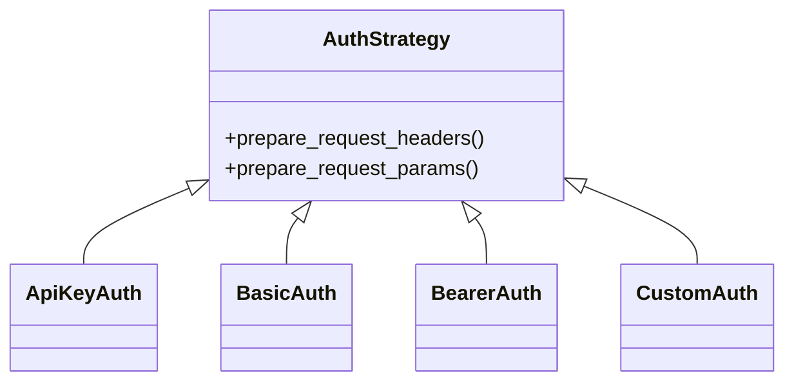

# apiconfig.auth.strategies

Collection of authentication strategies used by **apiconfig**. These classes implement common HTTP authentication schemes and share a common interface so they can be swapped out easily.

## Contents
- `api_key.py` – API key authentication via header or query parameter.
- `basic.py` – HTTP Basic authentication.
- `bearer.py` – Bearer token authentication with optional refresh support.
- `custom.py` – Fully customizable authentication through callbacks.
- `__init__.py` – Exports `ApiKeyAuth`, `BasicAuth`, `BearerAuth` and `CustomAuth`.

## Usage
### API Key
```python
from apiconfig.auth.strategies import ApiKeyAuth

auth = ApiKeyAuth(api_key="secret", header_name="X-API-Key")
headers = auth.prepare_request_headers()
```

### Basic
```python
from apiconfig.auth.strategies import BasicAuth

auth = BasicAuth(username="alice", password="wonderland")
headers = auth.prepare_request_headers()
```

### Bearer with refresh
```python
from datetime import datetime, timedelta
from apiconfig.auth.strategies import BearerAuth

expires = datetime.utcnow() + timedelta(hours=1)
auth = BearerAuth(access_token="token", expires_at=expires)
headers = auth.prepare_request_headers()
```

### Custom
```python
from apiconfig.auth.strategies import CustomAuth

def header_cb():
    return {"X-Custom": "value"}

auth = CustomAuth(header_callback=header_cb)
headers = auth.prepare_request_headers()
```

## Key Classes
| Class | Description |
| ----- | ----------- |
| `ApiKeyAuth` | Sends an API key either in a header or as a query parameter. |
| `BasicAuth` | Adds an `Authorization` header using Basic credentials. |
| `BearerAuth` | Handles bearer tokens and optional refresh logic. |
| `CustomAuth` | User-supplied callbacks for arbitrary authentication schemes. |

All strategies inherit from `AuthStrategy` (strategy pattern), allowing the client configuration to remain decoupled from the concrete authentication method.

## Diagram


## Tests
Install dependencies and run the unit tests:
```bash
python -m pip install -e .
python -m pip install pytest pytest-xdist
pytest tests/unit/auth/strategies -q
```

## Status
Stable – used across the library for authenticated HTTP requests.
