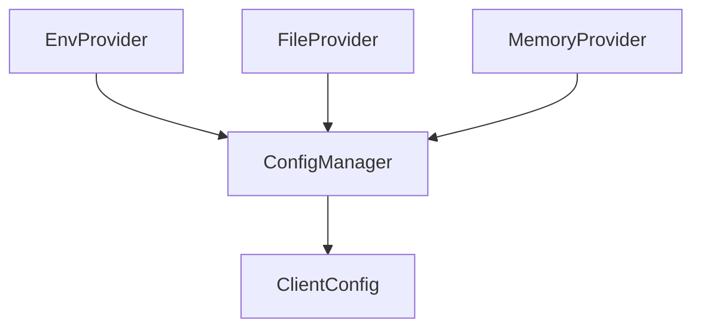

# apiconfig.config.providers

This package contains lightweight configuration providers used by `apiconfig`.
Providers supply configuration dictionaries from various sources and are often
combined with `ConfigManager` to build a final client configuration.

## Contents

- `env.py` – `EnvProvider` loads settings from environment variables with basic
  type inference and optional key prefixing.
- `file.py` – `FileProvider` reads configuration from JSON files and supports
  dot notation when retrieving nested values.
- `memory.py` – `MemoryProvider` keeps configuration in memory. Useful for
  tests or composing default values.
- `__init__.py` – re-exports the provider classes for convenient imports.

## Usage

```python
from apiconfig.config.manager import ConfigManager
from apiconfig.config.providers import EnvProvider, FileProvider, MemoryProvider

# Load from multiple sources
env = EnvProvider(prefix="MYAPI_")
file_provider = FileProvider("config.json")
memory_provider = MemoryProvider({"timeout": 5.0})

manager = ConfigManager([env, file_provider, memory_provider])
config_data = manager.load_config()
```

### Accessing values directly

```python
env = EnvProvider()
timeout = env.get("TIMEOUT", expected_type=float)
```

## Key Classes

### `EnvProvider`
Loads values from environment variables matching a prefix (default
`"APICONFIG_"`). Basic types like integers, booleans and floats are detected
automatically. The `get()` method also supports explicit type coercion.

### `FileProvider`
Reads configuration from a JSON file and exposes a `get()` method that accepts
dot-separated keys for nested lookups. Values may be coerced to common Python
types such as `int`, `float` or `bool`.

### `MemoryProvider`
Holds configuration data in a dictionary supplied at initialization. Mainly used
for tests or when constructing layered configurations in code.

## Architecture



## Testing

Run the project's test suite with `pytest`:

```bash
pytest --cov=apiconfig --cov-report=html
```

## Status

Beta – APIs may change while the project matures.
