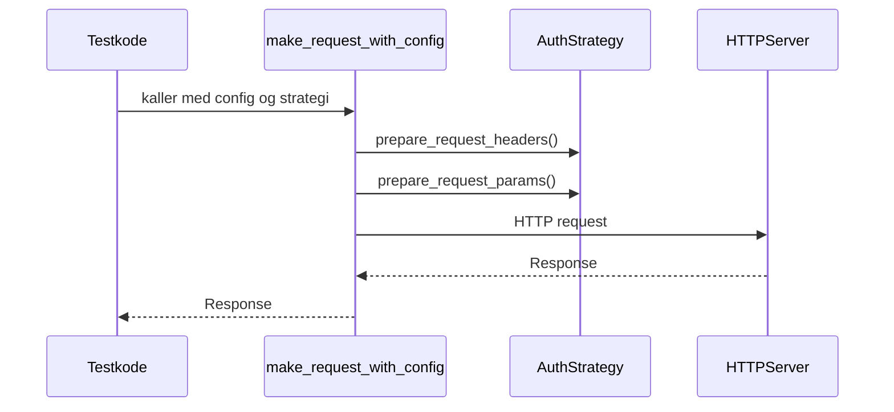

# apiconfig.testing.integration

Verktøy for å forenkle integrasjonstesting av API‑klienter som bruker
**apiconfig**. Pakken gir pytest‑fixtures og hjelpefunksjoner for å sette
opp mock‑servere, gjøre forespørsler med ferdig konfigurert klient samt
simulere token‑endepunkter.

## Innhold
- `fixtures.py` – pytest‑fixtures som `httpserver_listen_address`,
  `mock_api_url`, `temp_config_file` og fabrikk for `CustomAuth`.
- `helpers.py` – funksjoner som `make_request_with_config`,
  `setup_multi_provider_manager` og `simulate_token_endpoint`.
- `servers.py` – funksjoner for å konfigurere mock‑responser og
  verifisere mottatte forespørsler.
- `__init__.py` – re‑eksporterer sentrale hjelpefunksjoner.

## Eksempel på bruk
```python
from pytest_httpserver import HTTPServer
from apiconfig.auth.strategies import BasicAuth
from apiconfig.config.base import ClientConfig
from apiconfig.testing.integration import (
    configure_mock_response,
    make_request_with_config,
    setup_multi_provider_manager,
)

# Sett opp mock‑server
httpserver = HTTPServer()
configure_mock_response(httpserver, "/ping", response_data={"ok": True})

# Lag konfigurasjon og strategi
config_sources = [("defaults", {"api": {"hostname": str(httpserver.host)}})]
manager = setup_multi_provider_manager(config_sources)
config = manager.get_config()
auth = BasicAuth(username="user", password="pass")

# Gjør en forespørsel mot mock‑serveren
response = make_request_with_config(
    config,
    auth,
    str(httpserver.url_for("/")),
    "/ping",
)
assert response.json() == {"ok": True}
```

## Nøkkelfunksjoner
| Funksjon | Beskrivelse |
| -------- | ----------- |
| `configure_mock_response` | Definerer forventede forespørsler og svar for `HTTPServer`. |
| `assert_request_received` | Sjekker at mock‑serveren mottok forespørsler med ønskede parametre. |
| `make_request_with_config` | Utfører HTTP‑kall med gitt `ClientConfig` og `AuthStrategy`. |
| `setup_multi_provider_manager` | Oppretter `ConfigManager` med flere `MemoryProvider`‑instanser for testing. |
| `simulate_token_endpoint` | Setter opp et enkelt token‑endepunkt som kan brukes i autentiseringstester. |

### Designmønstre
Hjelpefunksjonene bruker **Facade**‑mønsteret for å skjule kompleksiteten ved
oppsett av autentisering og konfigurasjon når tester skrives.

## Diagram


## Testing
Installer prosjektet og kjør enhetstestene for denne pakken:
```bash
python -m pip install -e .
python -m pip install pytest pytest-httpserver
pytest tests/unit/testing/integration -q
```

## Status
Stabil – brukt i testene for **apiconfig** for å verifisere samspill mot
mock‑servere.
