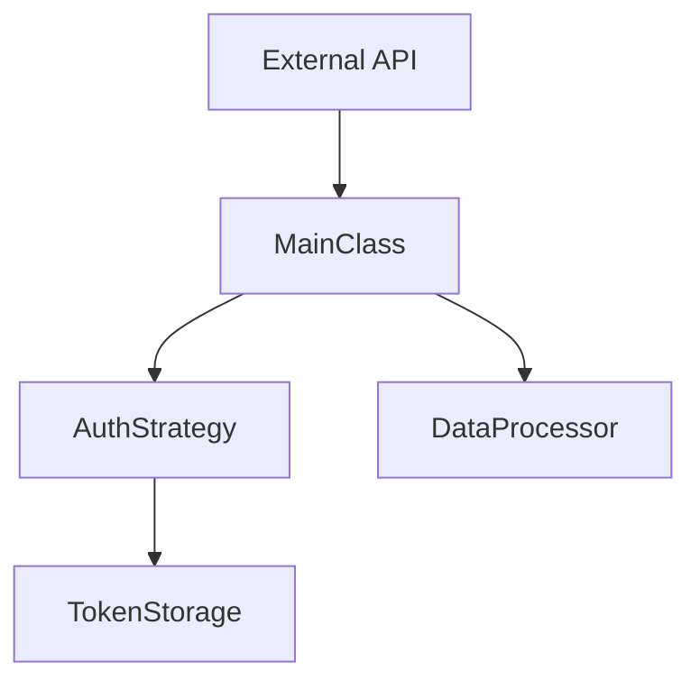

# Internal Module Documentation Design Guide for apiconfig

## Overview

This document defines the design principles and standards for internal module documentation within the apiconfig project. Each module and submodule in the production folder `apiconfig/` shall maintain a `README.md` file that serves as comprehensive, standalone documentation.

## Purpose

The internal module documentation system aims to:
- Provide clear, self-contained documentation for each module
- Create a navigable hierarchy of documentation that mirrors the code structure
- Enable new developers to quickly understand module purposes and usage
- Maintain consistency across all module documentation
- Support both bottom-up learning (from specific modules) and top-down exploration (from package roots)

## Documentation Structure

### 1. Module Header

Each README.md must begin with:
# apiconfig.<module.path>

<One-line description of the module's primary purpose>

### 2. Module Description

A clear, precise description (2-4 paragraphs) covering:
- **What** the module does
- **Why** it exists (the problem it solves)
- **How** it fits into the larger apiconfig ecosystem
- Key design decisions or architectural choices

### 3. Navigation Links

Hierarchical references for easy navigation:
**Parent Module:** [apiconfig.parent](../README.md)
**Submodules:**
- [apiconfig.module.submodule1](./submodule1/README.md)
- [apiconfig.module.submodule2](./submodule2/README.md)

### 4. Contents

A structured list of the module's components:
## Contents
- `main_file.py` – Primary implementation with core functionality
- `helpers.py` – Utility functions supporting the main module
- `types.py` – Type definitions and protocols
- `submodule/` – Subpackage handling specific functionality
- `__init__.py` – Public API exports and module initialization

### 5. Usage Examples

Practical Python examples demonstrating typical usage:

## Usage Example
```python
from apiconfig.module import MainClass, helper_function

# Basic usage
instance = MainClass(param="value")
result = instance.process()

# Advanced usage with context
with instance.context() as ctx:
    data = helper_function(ctx)
```

### 6. Key Components

Detailed explanation of important elements:

## Key Components

| Component | Type | Description |
|-----------|------|-------------|
| `MainClass` | Class | Primary class implementing the module's core functionality |
| `helper_function` | Function | Utility function for data transformation |
| `ModuleProtocol` | Protocol | Interface definition for extensibility |

### Design Patterns
The module implements the **Strategy Pattern** for flexible behavior configuration...

### 7. Architecture Visualization

Mermaid diagrams or ASCII art showing module structure:
## Architecture



### 8. Testing

Instructions for running module-specific tests:
## Testing

### Prerequisites
- Python 3.11+
- pytest
- Module-specific test dependencies: `httpx`, `pytest-mock`

### Running Tests
```bash
# Run unit tests for this module
pytest tests/unit/module_name/

# Run with coverage
pytest tests/unit/module_name/ --cov=apiconfig.module_name
```

### Test Structure
- `tests/unit/module_name/` – Unit tests
- `tests/integration/module_name/` – Integration tests (if applicable)

### 9. Dependencies

External and internal dependencies:
## Dependencies

### External
- `typing` – Type hints and protocols
- `json` – JSON processing (stdlib)

### Internal
- `apiconfig.exceptions` – Custom exception classes
- `apiconfig.types` – Shared type definitions

### 10. Status

Current module status and stability:
## Status

**Stability:** Stable
**Version:** Internal (follows apiconfig versioning)
**Deprecation:** None

### Notes
- This module is considered production-ready
- API is stable and covered by semantic versioning
- Performance optimizations planned for v2.0

## Hierarchy Requirements

### Parent References
Every non-root module must reference its parent module at the top of the navigation section.

### Child References
Every module with submodules must list all direct children in the navigation section.

### Cross-References
Modules may reference related modules (not in direct hierarchy) in a "See Also" section:
## See Also
- [apiconfig.auth.strategies](../auth/strategies/README.md) – Related authentication implementations
- [apiconfig.utils.http](../utils/http.py) – HTTP utilities used by this module

## Style Guidelines

### Language
- Use clear, concise English
- Write in present tense
- Use active voice
- Avoid jargon without explanation

### Code Examples
- Examples should be runnable (imports included)
- Use realistic but simple scenarios
- Include both basic and advanced usage
- Add comments explaining non-obvious behavior

### Formatting
- Use proper Markdown formatting
- Maintain consistent heading levels
- Use code fences with language hints
- Tables for structured comparisons

### Diagrams
- Prefer Mermaid for flowcharts and sequence diagrams
- Use ASCII art for simple structures
- Ensure diagrams render correctly on GitHub

## Maintenance

### Creation
- Create README.md when creating a new module
- Use this design guide as a template
- Review existing module documentation for consistency

### Updates
- Update README.md when module functionality changes
- Keep examples current with API changes
- Update status section for deprecations

### Review
- Include README.md updates in code reviews
- Verify hierarchy links remain valid
- Check that examples still run correctly

## Benefits

This documentation approach provides:
1. **Self-contained understanding** - Each module's documentation is complete
2. **Navigable structure** - Easy to traverse the codebase through documentation
3. **Consistent experience** - Predictable documentation format across all modules
4. **Learning path** - New developers can start anywhere and expand understanding
5. **Maintenance clarity** - Clear status and dependency information
6. **Test confidence** - Direct access to testing instructions

## Implementation Notes

- Start with high-level modules and work down to leaves
- Ensure all existing README.md files conform to this standard
- Use automated tools to verify link integrity
- Consider generating parts of the documentation from code introspection
- Maintain a documentation index at the package root

This design ensures that the apiconfig project maintains professional, comprehensive internal documentation that scales with the codebase and supports both current and future developers.