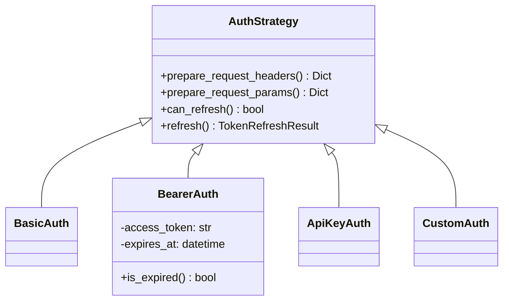
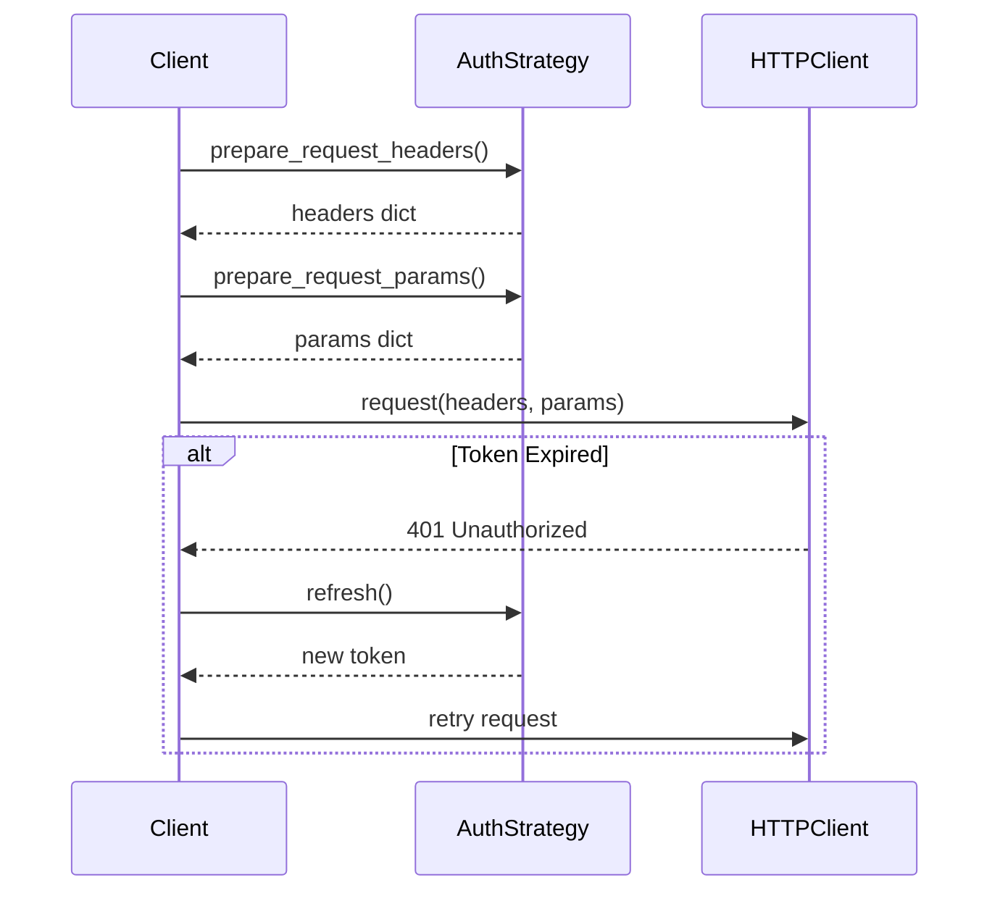

# Internal Module Documentation Design Guide for apiconfig

## Overview

This document defines the design principles and standards for internal module documentation within the apiconfig project. Each module and submodule in the production folder `apiconfig/` must maintain a `README.md` file that serves as comprehensive, standalone documentation.

## Core Principle

**Each `README.md` must be able to stand alone as complete documentation for the module, providing everything a developer needs to understand and use that module without requiring knowledge of other documentation.**

## Purpose

The internal module documentation system aims to:
- Provide complete, self-contained documentation for each module
- Create a navigable hierarchy of documentation that mirrors the code structure
- Enable new developers to quickly understand module purposes, usage, and design
- Maintain consistency across all module documentation
- Support both bottom-up learning (from specific modules) and top-down exploration (from package roots)

## Required Structure

Every module README.md must contain the following sections in this order:

### 1. Module Header

Format:
```
# apiconfig.<module.path>

<One-line description of the module's primary purpose>
```

### 2. Module Description

A clear, precise description (2-4 paragraphs) that explains:
- **What** the module does (functionality)
- **Why** it exists (the problem it solves)
- **How** it fits into the larger apiconfig ecosystem
- Key design decisions or architectural choices

Example:

> This module provides the core authentication framework for apiconfig. It defines the abstract `AuthStrategy` base class and implements common authentication patterns like Basic, Bearer, and API Key authentication.
>
> The module exists to solve the problem of API authentication heterogeneity - different APIs use different authentication methods, but client code should not need to know these details. By using the Strategy pattern, this module allows authentication logic to be swapped without changing client code.
>
> Within apiconfig, this module is fundamental - the `ClientConfig` class depends on `AuthStrategy` implementations, and all HTTP requests are authenticated using these strategies. The module is designed for extensibility, allowing users to implement custom authentication strategies by subclassing `AuthStrategy`.

### 3. Navigation Links

Hierarchical references for easy navigation:

Format:
```
## Navigation

**Parent Module:** [apiconfig.parent](../README.md)

**Submodules:**
- [apiconfig.module.submodule1](./submodule1/README.md) - Brief description
- [apiconfig.module.submodule2](./submodule2/README.md) - Brief description

**See Also:**
- [apiconfig.related.module](../related/module/README.md) - Why it's related
```

### 4. Contents

A structured list of all files and directories with explanations:

Format:
```
## Contents

### Core Files
- `base.py` – Abstract base class defining the authentication interface
- `strategies.py` – Concrete implementations of common auth patterns
- `types.py` – Type definitions and protocols for auth-related data

### Subpackages
- `strategies/` – Individual strategy implementations (Basic, Bearer, etc.)
- `token/` – Token management and refresh utilities

### Configuration
- `__init__.py` – Public API exports and module initialization
```

### 5. Usage Examples

Practical, runnable Python examples demonstrating typical usage:

The markdown structure should be:
```
## Usage Examples

### Basic Usage
[Python code example with imports and basic authentication setup]

### Advanced Usage
[Python code example with custom authentication implementation]
```

Example content structure:

**Basic Usage:**
```python
from apiconfig.auth import BasicAuth, BearerAuth
from apiconfig import ClientConfig

# API Key authentication
auth = ApiKeyAuth(api_key="secret-key", header_name="X-API-Key")
config = ClientConfig(hostname="api.example.com", auth_strategy=auth)

# Bearer token with refresh
auth = BearerAuth(
    access_token="initial-token",
    refresh_callback=lambda: fetch_new_token(),
    expires_at=datetime.now() + timedelta(hours=1)
)
```

**Advanced Usage:**
```python
from apiconfig.auth import AuthStrategy

# Custom authentication implementation
class CustomAuth(AuthStrategy):
    def prepare_request_headers(self):
        return {"X-Custom-Auth": self.generate_signature()}

    def prepare_request_params(self):
        return {"auth_timestamp": int(time.time())}

# Using with configuration
custom_auth = CustomAuth(secret="my-secret")
config = ClientConfig(hostname="api.custom.com", auth_strategy=custom_auth)
```

### 6. Key Components

Detailed explanation of important elements:

The markdown structure should include:

**Section Header:**
```
## Key Components
```

**Content Format:**
- Classes table with columns: Class, Description, Key Methods
- Design Patterns section explaining Strategy and Template Method patterns
- Key Functions list with function signatures and descriptions

Example table:
| Class | Description | Key Methods |
|-------|-------------|-------------|
| `AuthStrategy` | Abstract base class for all authentication strategies | `prepare_request_headers()`, `prepare_request_params()` |
| `BasicAuth` | HTTP Basic Authentication (RFC 7617) | Inherits from AuthStrategy |
| `BearerAuth` | Bearer token authentication with optional refresh | `refresh()`, `is_expired()` |

### 7. Architecture Visualization

Mermaid diagrams or ASCII art showing module structure and interactions:

The markdown structure should be:
```
## Architecture

### Class Hierarchy
[Mermaid diagram showing class inheritance relationships]

### Authentication Flow
[Mermaid sequence diagram showing authentication process]
```

Example diagrams:

**Class Hierarchy:**


**Authentication Flow:**


### 8. Testing

Comprehensive testing instructions:

The markdown structure should include:
```
## Testing

### Test Structure
- List of test directories and their purposes

### Running Tests
[Bash commands for running tests]

### Test Dependencies
- List of required testing packages

### Writing Tests
- Guidelines for writing new tests
```

Example commands:

```bash
# Run all auth module tests
pytest tests/unit/auth/ -v

# Run with coverage
pytest tests/unit/auth/ --cov=apiconfig.auth --cov-report=html

# Run specific strategy tests
pytest tests/unit/auth/strategies/test_bearer.py -k "test_refresh"
```

### 9. Dependencies

Clear listing of all dependencies:

Format:
```
## Dependencies

### External Dependencies
- List of external packages with their purposes

### Internal Dependencies
- List of internal module dependencies

### Optional Dependencies
- List of optional packages and when they're needed
```

Example structure:
- External: `typing`, `datetime`, `base64` (all stdlib)
- Internal: `apiconfig.exceptions.auth`, `apiconfig.types`, `apiconfig.utils.http`
- Optional: `httpx` (for refresh callbacks), `cryptography` (for JWT validation)

### 10. Status and Maintenance

Current module status and maintenance information:

Format:
```
## Status

**Stability:** [Stable/Beta/Experimental]
**API Version:** [version number]
**Deprecations:** [None or list]

### Maintenance Notes
- Current status and stability information

### Changelog
- Version history with dates and changes

### Future Considerations
- Planned features or improvements
```

## Hierarchy Requirements

### Mandatory Navigation
1. **Every** module must reference its parent (except root `apiconfig/`)
2. **Every** module with submodules must list all direct children
3. Navigation links must use relative paths
4. Brief descriptions must accompany child module links

### Cross-References
Use "See Also" section for related modules outside the direct hierarchy:

Format:
```
## See Also
- [apiconfig.config.base](../config/base/README.md) – ClientConfig uses AuthStrategy
- [apiconfig.exceptions.auth](../exceptions/auth/README.md) – Auth-specific exceptions
```

## Quality Guidelines

### Language and Tone
- Use clear, concise English
- Write in present tense
- Use active voice
- Define jargon on first use
- Assume reader knows Python but not apiconfig

### Code Examples
- **Must be runnable** - include all imports
- Show both basic and advanced usage
- Use realistic scenarios
- Include inline comments explaining non-obvious behavior
- Test all examples before committing

### Formatting Standards
- Use proper Markdown formatting
- Maintain consistent heading levels (# for title, ## for major sections, ### for subsections)
- Use code fences with language hints (\`\`\`python)
- Tables for structured comparisons
- Bold for emphasis, italics for new terms

### Visualization Requirements
- Prefer Mermaid for diagrams (renders on GitHub)
- Use ASCII art only for simple structures
- Ensure all diagrams have accompanying text descriptions
- Test diagram rendering on GitHub before committing

## Maintenance Workflow

### Creating New Module Documentation
1. Create README.md when creating the module
2. Use this guide as a template
3. Copy structure from a similar existing module
4. Have documentation reviewed with code

### Updating Documentation
1. Update README.md in the same commit as code changes
2. Update examples to reflect API changes
3. Update status section for deprecations
4. Update navigation links if module structure changes

### Documentation Review Checklist
- [ ] All required sections present
- [ ] Examples are runnable
- [ ] Navigation links are valid
- [ ] Diagrams render correctly
- [ ] Status accurately reflects module state
- [ ] Dependencies are complete
- [ ] Test instructions work

## Benefits

This documentation approach provides:

1. **Complete Understanding** - Developers can fully understand a module from its README alone
2. **Easy Navigation** - Clear hierarchy makes exploring the codebase intuitive
3. **Consistent Experience** - Predictable format reduces cognitive load
4. **Flexible Learning** - Supports both top-down and bottom-up exploration
5. **Maintenance Clarity** - Status and dependencies prevent confusion
6. **Test Confidence** - Clear testing instructions ensure quality

## Implementation Priority

1. Start with top-level modules (`auth/`, `config/`, `exceptions/`, `utils/`)
2. Document heavily-used modules first
3. Work down to leaf modules
4. Validate all links before considering complete

## Automation Opportunities

Consider tooling for:
- Generating navigation sections from directory structure
- Validating link integrity
- Extracting class/function lists from code
- Checking example code validity
- Generating dependency graphs

This design ensures that apiconfig maintains professional, comprehensive internal documentation that truly serves as standalone resources for understanding each module.