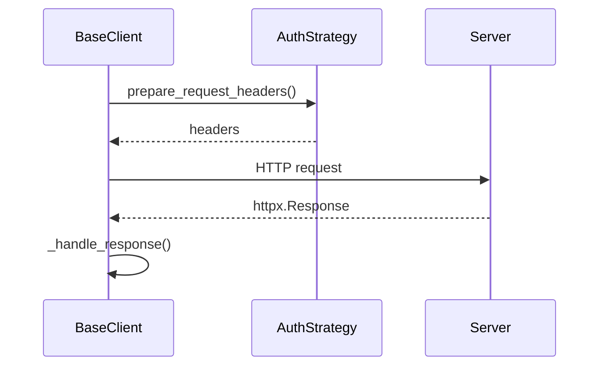

# helpers_for_tests.common

Shared helpers used by the example integration clients. This package exposes a simple `BaseClient` class that builds on top of **apiconfig**'s configuration and authentication system.

## Contents
- `base_client.py` – generic HTTP client with error handling and JSON parsing.
- `__init__.py` – package marker.

## Usage example
```python
from typing import Dict, Optional

from helpers_for_tests.common.base_client import BaseClient
from apiconfig.auth.base import AuthStrategy
from apiconfig.config import ClientConfig
from apiconfig.types import HttpMethod

class DummyAuth(AuthStrategy):
    def prepare_request_headers(self) -> Dict[str, str]:
        return {"Authorization": "Bearer token"}

    def prepare_request_params(self) -> Optional[dict]:
        return None

config = ClientConfig(hostname="https://api.example.com", auth_strategy=DummyAuth())
client = BaseClient(config)

result = client._request(HttpMethod.GET, "/ping")
print(result)
```

## Key classes
| Name | Description |
| ---- | ----------- |
| `BaseClient` | Base class that prepares URLs and headers and parses JSON responses. |

### Design
`BaseClient` follows a light template approach where `_request` delegates authentication details to the configured `AuthStrategy`.



## Tests
```bash
python -m pip install -e .
python -m pip install pytest
pytest tests/unit/helpers/common -q
```

## Status
Internal – intended only for the helper clients used in tests.
