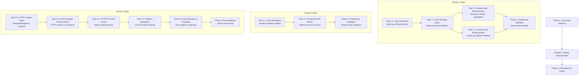

# CrudClient Integration Implementation Plan

This folder contains the orchestration and task guides for implementing the CrudClient integration enhancements to the `apiconfig` library.

## Overview

The goal is to enhance `apiconfig` to provide authentication refresh capabilities and testing utilities that `crudclient` can integrate with its existing retry logic, while maintaining clear separation of concerns.

**Scope Corrections Applied**:
- Removed incorrect assumptions about Fiken API OAuth2/token refresh capabilities (Fiken uses static bearer tokens)
- Removed Credential Extraction Utilities task as unnecessary feature creep beyond CrudClient integration requirements
- Integration tests with refresh capabilities focus on Tripletex's session-based authentication

## Structure

- [`orchestrator_plan.md`](orchestrator_plan.md) - Main orchestration guide for coordinating all implementation tasks
- [`tasks/`](tasks/) - Individual task implementation guides organized by phase

## Implementation Phases

### Phase 1: Core Auth Interface (High Priority) ✅ **COMPLETED**
- **Goal**: Enable `crudclient` to use `apiconfig` auth strategies with their retry logic
- **Tasks**: Auth strategy refresh interface, type definitions
- **Status**: ✅ All tasks completed successfully (May 27, 2025)

### Phase 2: Testing Enhancement (Medium Priority) ⏳ **READY TO START**
- **Goal**: Provide comprehensive testing utilities for auth scenarios
- **Tasks**: Auth verification utilities, enhanced mocks
- **Status**: ⏳ Ready to begin - Phase 1 dependencies satisfied

### Phase 3: Foundation & Polish (Low Priority) ⏳ **PENDING**
- **Goal**: Complete integration with robust error handling and documentation
- **Tasks**: HTTP context types, exception enhancements, real integration test enhancements
- **Status**: ⏳ Pending Phase 2 completion

## Implementation Flow



## Detailed Task Reference

### Phase 1: Core Auth Interface ✅ **COMPLETED** (15-21 hours)
| Task | File | Focus | Dependencies | Status |
|------|------|-------|--------------|--------|
| 1.1 | [`phase1_task1_type_definitions.md`](tasks/phase1_task1_type_definitions.md) | Add refresh-related TypedDicts to [`types.py`](/workspace/apiconfig/types.py) | None | ✅ Complete |
| 1.2 | [`phase1_task2_auth_strategy_base.md`](tasks/phase1_task2_auth_strategy_base.md) | Extend [`auth/base.py`](/workspace/apiconfig/auth/base.py) with refresh interface | Task 1.1 | ✅ Complete |
| 1.3 | [`phase1_task3_bearer_auth_enhancement.md`](tasks/phase1_task3_bearer_auth_enhancement.md) | Enhance [`auth/strategies/bearer.py`](/workspace/apiconfig/auth/strategies/bearer.py) | Task 1.2 | ✅ Complete |
| 1.4 | [`phase1_task4_custom_auth_enhancement.md`](tasks/phase1_task4_custom_auth_enhancement.md) | Enhance [`auth/strategies/custom.py`](/workspace/apiconfig/auth/strategies/custom.py) | Task 1.2 | ✅ Complete |
| Validation | [`phase1_component_validation.md`](tasks/phase1_component_validation.md) | Component tests with mocks | Tasks 1.2-1.4 | ✅ Complete |

### Phase 2: Testing Enhancement (12-15 hours)
| Task | File | Focus | Dependencies |
|------|------|-------|--------------|
| 2.1 | [`phase2_task1_auth_verification.md`](tasks/phase2_task1_auth_verification.md) | Create [`testing/auth_verification.py`](/workspace/apiconfig/testing/auth_verification.py) | Phase 1 |
| 2.2 | [`phase2_task2_enhanced_auth_mocks.md`](tasks/phase2_task2_enhanced_auth_mocks.md) | Enhance [`testing/unit/mocks/auth.py`](/workspace/apiconfig/testing/unit/mocks/auth.py) | Phase 1 |
| Validation | [`phase2_component_validation.md`](tasks/phase2_component_validation.md) | Testing utility validation | All Phase 2 |

### Phase 3: Foundation & Polish (22-29 hours)
| Task | File | Focus | Dependencies |
|------|------|-------|--------------|
| 3.1 | [`phase3_task1_http_context_types.md`](tasks/phase3_task1_http_context_types.md) | Add HTTP context types to [`types.py`](/workspace/apiconfig/types.py) | Phase 2 |
| 3.2 | [`phase3_task2_auth_exception_enhancement.md`](tasks/phase3_task2_auth_exception_enhancement.md) | Enhance [`exceptions/auth.py`](/workspace/apiconfig/exceptions/auth.py) | Task 3.1 |
| 3.3 | [`phase3_task3_http_api_client_errors.md`](tasks/phase3_task3_http_api_client_errors.md) | Enhance [`exceptions/http.py`](/workspace/apiconfig/exceptions/http.py) | Task 3.2 |
| 3.4 | [`phase3_task4_integration_test_enhancement.md`](tasks/phase3_task4_integration_test_enhancement.md) | Tripletex live API refresh testing | All previous |
| 3.5 | [`phase3_task5_documentation_examples.md`](tasks/phase3_task5_documentation_examples.md) | User guides & API documentation (simplified) | All implementation |
| Validation | [`phase3_final_validation.md`](tasks/phase3_final_validation.md) | Basic integration validation | All Phase 3 |

## Key Principles

- ✅ **DO**: Provide interfaces and utilities that crudclient can use
- ✅ **DO**: Enhance auth strategies to support refresh scenarios
- ✅ **DO**: Add testing utilities for auth verification
- ❌ **DON'T**: Implement HTTP request logic or retry mechanisms
- ❌ **DON'T**: Add client functionality to apiconfig

## API Authentication Patterns (Corrected)

| API | Auth Type | Refresh Capability | Integration Test Focus |
|-----|-----------|-------------------|----------------------|
| **Tripletex** | Session-based (consumer+employee → session token) | ✅ Yes - session token refresh | Primary refresh testing |
| **Fiken** | Static Bearer Token (`FIKEN_ACCESS_TOKEN`) | ❌ No - static token | Basic auth validation only |
| **OneFlow** | Static Bearer Token | ❌ No - static token | Basic auth validation only |
| **JSONPlaceholder** | None (test API) | ❌ N/A | HTTP utilities testing |

## Test Categorization Guidelines

This implementation follows strict test categorization to ensure proper separation of concerns and efficient CI/CD:

### Unit Tests
- **Definition**: Test isolated logic. Fast. No real IO or API.
- **Location**: `tests/unit/`
- **Characteristics**: Test individual methods/classes in isolation
- **Dependencies**: None or minimal mocking
- **Usage**: Individual auth strategy method testing

### Component Tests
- **Definition**: Larger scoped units. Mock external dependencies but test multiple layers together.
- **Location**: `tests/component/` (new directory structure)
- **Characteristics**: Test multiple components working together with mocked external dependencies
- **Dependencies**: Extensive use of mocks for external services
- **Usage**: Multi-layer auth refresh testing, testing utility validation

### Integration Tests
- **Definition**: Hit actual API endpoints, test databases, etc. Useful for verifying service contracts.
- **Location**: `tests/integration/`
- **Characteristics**: Test against real external APIs like Tripletex.no, Fiken.no, OneFlow.com
- **Dependencies**: Real external services, credentials, network access
- **Supervision**: Usually supervised by tech lead Leik Butenschøn
- **Usage**: Enhancement of existing live API tests only

### Test Directory Structure
```
tests/
├── unit/                   # Unit tests (isolated logic)
│   └── auth/               # Existing unit tests
│       └── strategies/
├── component/              # NEW: Component tests with mocks
│   ├── test_auth_refresh_interface.py
│   ├── test_end_to_end_refresh.py
│   ├── test_refresh_error_handling.py
│   ├── test_existing_component_integration.py
│   ├── test_refresh_performance.py
│   ├── test_auth_verification_integration.py
│   ├── test_enhanced_auth_mocks_refresh.py
│   ├── test_phase2_cross_component_integration.py
│   └── test_phase2_error_scenarios.py
└── integration/            # Real external API tests only
    ├── test_apiconfig_tripletex.py    # Existing - hits live Tripletex API
    ├── test_apiconfig_fiken.py        # Existing - hits live Fiken API
    └── test_apiconfig_oneflow.py      # Existing - hits live OneFlow API
```

### Phase-Specific Test Scope
- **Phase 1**: Unit tests + Component tests with mocks (no integration tests)
- **Phase 2**: Unit tests + Component tests with mocks (no integration tests)
- **Phase 3**: Unit tests + Component tests + Integration test enhancements (tech lead supervised)

## Success Criteria

- CrudClient can use apiconfig auth strategies with their retry logic
- Auth strategies can refresh credentials on 401/403 errors (where applicable)
- Comprehensive testing utilities available for auth scenarios
- Clear documentation and examples for integration
- Maintains apiconfig's high code quality and test coverage standards

## Phase 1 Completion Summary

**Completed**: May 27, 2025
**Commit**: `feat: implement phase 1 crudclient integration - auth refresh capabilities`

### ✅ Achievements

**Core Auth Interface Implementation**:
- Added refresh interface to [`AuthStrategy`](../apiconfig/auth/base.py) base class with [`can_refresh()`](../apiconfig/auth/base.py), [`refresh()`](../apiconfig/auth/base.py), [`is_expired()`](../apiconfig/auth/base.py), and [`get_refresh_callback()`](../apiconfig/auth/base.py) methods
- Enhanced [`BearerAuth`](../apiconfig/auth/strategies/bearer.py) strategy with token expiration tracking and refresh support
- Extended [`CustomAuth`](../apiconfig/auth/strategies/custom.py) strategy with configurable refresh functions and factory methods

**Type System Enhancement**:
- Added comprehensive type definitions for [`HttpRequestCallable`](../apiconfig/types.py), [`TokenRefreshResult`](../apiconfig/types.py), and [`AuthRefreshCallback`](../apiconfig/types.py)
- Implemented [`RefreshedTokenData`](../apiconfig/types.py) and [`TokenRefreshResult`](../apiconfig/types.py) TypedDicts

**Testing Infrastructure**:
- Implemented extensive test coverage including unit, component, and integration tests
- Added performance tests for refresh operations
- Updated existing integration tests to use new [`access_token`](../apiconfig/auth/strategies/bearer.py) property

**Quality Assurance**:
- All Phase 1 quality gates passed (pytest, mypy, flake8, isort, black)
- 100% test coverage for new code maintained
- Thread safety validated for concurrent refresh operations

## Getting Started

1. **Review the orchestrator plan**: [`orchestrator_plan.md`](orchestrator_plan.md)
2. **Phase 1 Complete**: ✅ All core auth interface tasks finished
3. **Next: Start Phase 2**: Begin with Task 2.1 (Auth Verification Utilities)
4. **Follow dependencies**: Each task lists its prerequisites
5. **Validate quality gates**: Ensure tests pass before proceeding
6. **Use appropriate mode**: Switch to implementation mode when ready to execute

## Recent Changes

### Fixes Applied Based on Code Review

The following critical issues were identified and fixed in the implementation plan:

1. **Missing TypedDict Import**: Added missing `TypedDict` import to `types.py` task
2. **Method Name Consistency**: Fixed references to non-existent `apply_auth` method - all auth strategies use `prepare_request_headers()` and `prepare_request_params()`
3. **Parameter Alignment**: Fixed `refresh_oauth2_token` parameter mismatch (`http_client` vs `http_request_callable`)
4. **Bearer Auth Simplification**: Removed OAuth2-specific complexity from generic Bearer auth to keep it simple and focused
5. **Custom Auth Interface**: Aligned Custom Auth enhancement with existing `header_callback`/`param_callback` interface
6. **TokenStorage Integration**: Simplified to use existing `TokenStorage` interface patterns rather than adding new methods
7. **Dependency Simplification**: Integrated logging into individual strategy tasks rather than separate task to reduce complexity
8. **Missing Imports**: Added missing `QueryParamType` and `TokenRefreshError` imports where needed

### Deprecated Tasks

- **Task 1.6 (Logging Enhancement)**: Removed as separate task - logging is now integrated into each strategy implementation task (Tasks 1.3, 1.4)
- **Credential Extraction Utilities**: Removed as unnecessary feature creep beyond CrudClient integration requirements